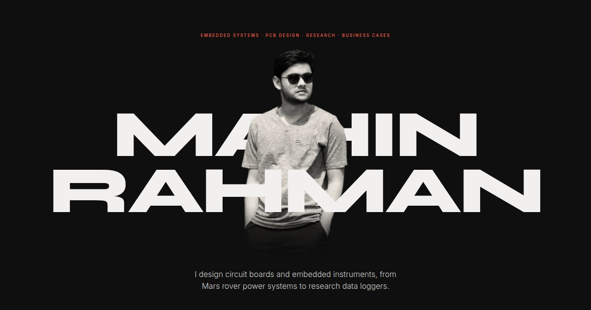
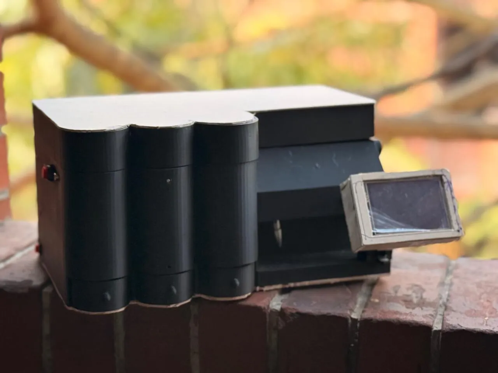
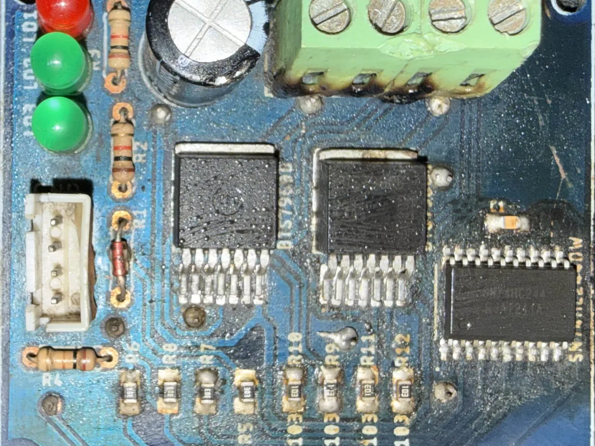
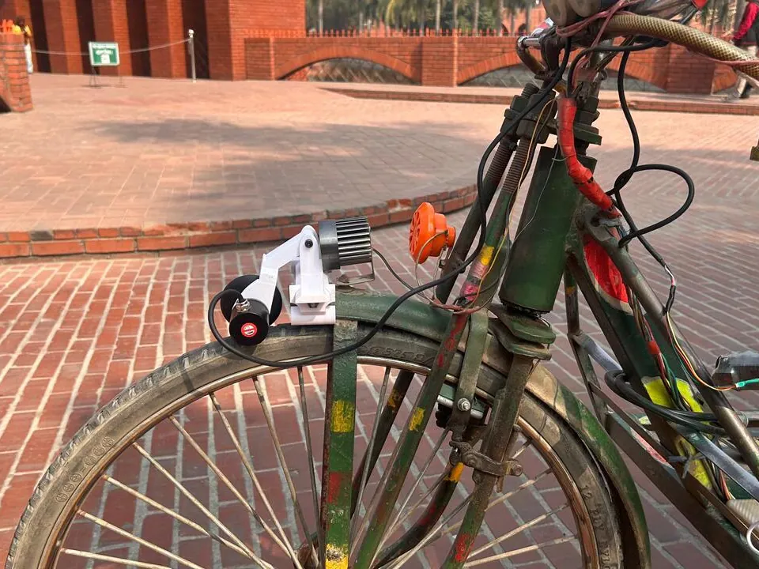
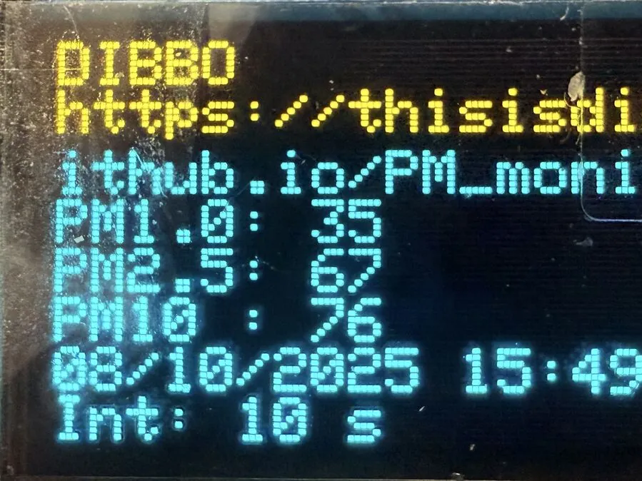
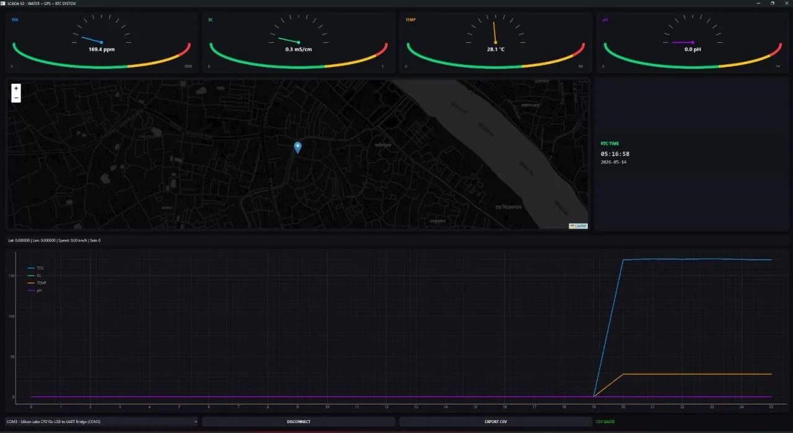
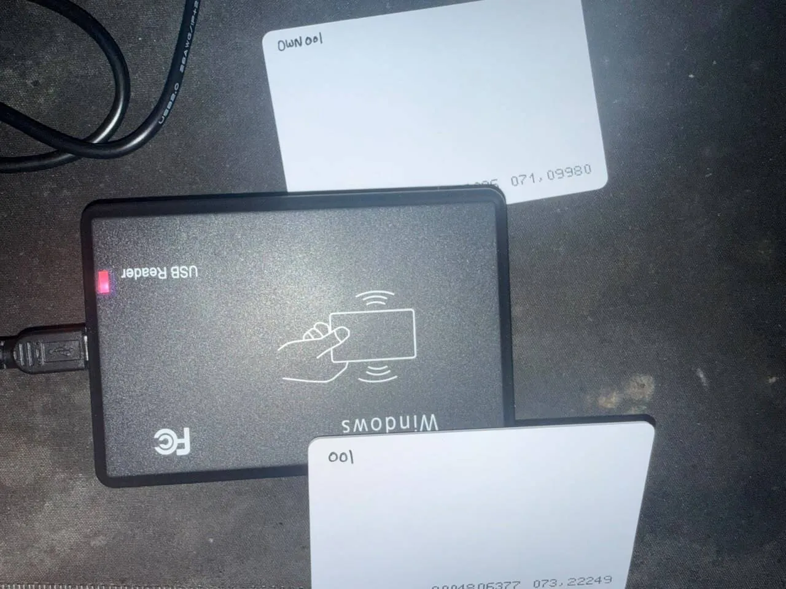

<p align="center">
  <a href="https://thisisdibbo.github.io">
    
  </a>
</p>

<h1 align="center">Md. Mahin Rahman</h1>

<p align="center">
  Embedded systems · PCB design · Research · Business cases<br>
  Electrical and Electronic Engineering · Islamic University of Technology, Bangladesh
</p>

<p align="center">
  <a href="https://thisisdibbo.github.io"><b>Website</b></a>
  &nbsp;·&nbsp;
  <a href="public/Md-Mahin-Rahman-CV.pdf">CV</a>
  &nbsp;·&nbsp;
  <a href="https://www.linkedin.com/in/md-mahin-rahman-5b720a34b">LinkedIn</a>
  &nbsp;·&nbsp;
  <a href="https://github.com/thisisdibbo">GitHub</a>
  &nbsp;·&nbsp;
  <a href="mailto:mr.d2003feb@gmail.com">Email</a>
</p>

---

I design circuit boards and embedded instruments, from Mars rover power systems to research data loggers.

I'm a fourth-year Electrical and Electronic Engineering student at the Islamic University of Technology (IUT) in
Gazipur, Bangladesh. On **Project Altair**, IUT's Mars rover team, I lead power distribution, protection and PCB
design for our competition rovers, along with embedded control and telemetry. I also build the instruments behind
transportation research as an undergraduate research assistant, run my own simulation research in optical wireless
communication and transient electronics, and compete in business case competitions.

This repository holds the source of my portfolio website, [thisisdibbo.github.io](https://thisisdibbo.github.io).

| 5 | 6.3 dB | 50+ | 3.64 |
| :-: | :-: | :-: | :-: |
| International rover-challenge finals with Project Altair, 2025–26 | SNR overstated by optical IRS models that omit the law of reflection | Participants in the Arduino workshop I taught for IEEE RAS | CGPA at IUT, out of 4.00 |

## Selected work

<table>
  <tr>
    <td width="33%" valign="top">
      <a href="https://github.com/thisisdibbo/Smart-Medical-Box"></a><br>
      <b><a href="https://github.com/thisisdibbo/Smart-Medical-Box">Smart Medical Box</a></b><br>
      <sub>ESP32 · ESP-NOW · 3D printing · 2025–26</sub><br>
      Dispenses pills on a schedule, then confirms each one with a piezo disc under the tray before pumping the syrup dose.
    </td>
    <td width="33%" valign="top">
      <a href="https://github.com/thisisdibbo/IBT2-BTS7960-Motor-Driver"></a><br>
      <b><a href="https://github.com/thisisdibbo/IBT2-BTS7960-Motor-Driver">IBT-2 motor driver PCB</a></b><br>
      <sub>PCB design · Power electronics · 2025</sub><br>
      A BTS7960B H-bridge I designed in EAGLE, fabricated and bench-tested. At full drive, the output matches the supply.
    </td>
    <td width="33%" valign="top">
      <a href="https://github.com/thisisdibbo/BreakProject"></a><br>
      <b><a href="https://github.com/thisisdibbo/BreakProject">BreakProject</a></b><br>
      <sub>ESP32 · VL53L0X · Rotary encoder · 2026</sub><br>
      A braking-distance and motion logger, field-tested on the front wheel of a cycle rickshaw.
    </td>
  </tr>
  <tr>
    <td width="33%" valign="top">
      <a href="https://github.com/thisisdibbo/ESP32-PM-Sensor"></a><br>
      <b><a href="https://github.com/thisisdibbo/ESP32-PM-Sensor">Portable air-quality logger</a></b><br>
      <sub>ESP32 · PMS5003 · GPS · RTC · 2025</sub><br>
      Logs PM1.0, PM2.5 and PM10 with GPS position and RTC time to an SD card, fully offline.
    </td>
    <td width="33%" valign="top">
      <a href="https://github.com/thisisdibbo/ESP32-Water-Quality-SCADA"></a><br>
      <b><a href="https://github.com/thisisdibbo/ESP32-Water-Quality-SCADA">WaterSCADA</a></b><br>
      <sub>ESP32 · PyQt6 · GPS · 2025–26</sub><br>
      A GPS-tagged water-quality logger with a PyQt6 SCADA dashboard, packaged as a single Windows executable.
    </td>
    <td width="33%" valign="top">
      <a href="https://github.com/thisisdibbo/rfid-rickshaw-system"></a><br>
      <b><a href="https://github.com/thisisdibbo/rfid-rickshaw-system">RFID rickshaw system</a></b><br>
      <sub>Python · Firebase · RFID · 2025</sub><br>
      Two RFID cards and a QR sticker tell anyone who is pulling a rickshaw right now, verified live.
    </td>
  </tr>
</table>

**Also built:** FPV drones with digital and analog video · a laser engraver with a custom power control panel ·
[DialIndicatorReader](https://github.com/thisisdibbo/DialIndicatorReader), which decodes a caliper protocol on an
Arduino Nano · [Multi Serial Monitor](https://github.com/thisisdibbo/MultiserialMonitor) for logging several load
cells at once · a Snake & Ladder game in 74xx logic · contributions to a Smart Audio Recognition System.

## Research

- **Reflection models for optical IRS in Li-Fi** · [code](https://github.com/thisisdibbo/oirs-vlc-reflection-model)<br>
  Showed that omitting the law of reflection overstates SNR by 6.3 dB, and derived the mirror optimum in closed form.<br>
  <sub>Lead and corresponding author · manuscript in preparation for Optics Communications</sub>
- **Transient chips with on-chip AI**<br>
  Biodegradable semiconductor devices paired with on-chip inference, simulated from Silvaco TCAD to Cadence Virtuoso.<br>
  <sub>Sole author · simulation study targeting a Q1 journal</sub>
- **Instruments for transportation research** · [BreakProject](https://github.com/thisisdibbo/BreakProject)<br>
  Encoder and time-of-flight brake logging on a cycle rickshaw, and load-cell and dial-indicator capture in the lab.<br>
  <sub>Undergraduate research assistant · Dr. Nazmus Sakib, Civil & Environmental Engineering, IUT</sub>

## Case competitions

On the [website](https://thisisdibbo.github.io/#cases), each deck opens in a slide viewer. The PDFs are also in
[`public/decks`](public/decks).

| Case | Competition | Deck |
| :-- | :-- | :-- |
| **TorqueFix Xpress** and **VoltEdge**<br>Informal roadside garages turned into branded, app-connected service hubs, starting from a ৳4.1M pilot. Round one was VoltEdge, solar battery-swap hubs for electric vehicles. | CaseMotion 2025<br>Round 1 and Finale<br><sub>Team Low Risk, Lower Effort</sub> | [Finale](public/decks/torquefix.pdf)<br>[Round&nbsp;1](public/decks/voltedge.pdf) |
| **SCOOP**<br>Bangladesh's first personalised ice-cream brand, with branded street carts and an app that learns each buyer's taste. | KBEC NEXUS S2, 2025<br><sub>Team One Last Run</sub> | [PDF](public/decks/scoop.pdf) |
| **Waste2Watt** and **PolyCycle Power**<br>Bottled biogas from Dhaka's organic waste at 29% below the price of LPG, reworked for plastic waste in round two. | CennoBiz 2024<br>Rounds 1 and 2<br><sub>Team Jilapi</sub> | [Round&nbsp;2](public/decks/polycycle.pdf)<br>[Round&nbsp;1](public/decks/waste2watt.pdf) |
| **Eco Tour**<br>App-led eco-tourism: digital visitor quotas at crowded sites, with community-run stays and guides. | CennoBiz 2025<br>Round 1<br><sub>Team That One Dept.</sub> | [PDF](public/decks/ecotour.pdf) |
| **TeleBarta 2.0**<br>A 24-month plan to turn a struggling state telecom operator into the country's fiber-first provider. | INTERN 2024, IUT Career & Business Society<br>Round 1<br><sub>Team Jilapi</sub> | [PDF](public/decks/telebarta.pdf) |
| **Smart Firefighter**<br>Firefighting drones and heat-resistant robots for Bangladesh's fire service, at roughly half the cost of one fire engine. | Techathon 1.0, IUT Robotics Society, 2024<br><sub>Team Jilapi</sub> | [PDF](public/decks/firefighter.pdf) |
| **Sheba.xyz, rebuilt around AI**<br>Predictive booking, AI support and a \*364# USSD line, so help reaches people without smartphones. | Preliminary round abstract, 2025<br><sub>Team Commitment Issues</sub> | [PDF](public/decks/sheba.pdf) |
| **Nova Drive**<br>Electric vehicles with battery swapping. | SolutionSpin, IUT National ICT Fest 2024<br><sub>Team Redflags</sub> | [PDF](public/decks/novadrive.pdf) |
| **Combat Drone**<br>A defence drone partnership plan. | Techathon 1.0, 2024<br><sub>Team Jilapi</sub> | [PDF](public/decks/combatdrone.pdf) |
| **Company X**<br>A supermarket turnaround: pricing, queues and supply chain. | 2025<br><sub>Team Jilapi</sub> | [PDF](public/decks/companyx.pdf) |

## Experience

- **Project Altair**, IUT's Mars rover team: senior member of the electrical sub-team (2024–). On-site finalist at the
  University Rover Challenge, the International Rover Challenge and the Anatolian Rover Challenge in 2026; University
  Rover Challenge finalist (18th of 36) and International Rover Challenge on-site finalist in 2025.
- **Undergraduate research assistant**, transportation engineering, Dept. of Civil & Environmental Engineering, IUT (2025–)
- **Joint Secretary**, IEEE Robotics & Automation Society, IUT Student Branch Chapter (2026–). Taught an Arduino
  workshop for 50+ participants.
- **Project Coordinator**, IUT Robotics Society (2023–)
- **Industrial attachment** at Ghorashal Power Station, BAEC, Robi Axiata and Walton Hi-Tech (2026)
- **B.Sc. in Electrical and Electronic Engineering**, Islamic University of Technology, CGPA 3.64 / 4.00 (2023–27)

## Toolkit

| Area | Tools |
| :-- | :-- |
| **Hardware** | ESP32, Arduino, power electronics, H-bridge drivers, FPV builds, 3D printing |
| **CAD & simulation** | EAGLE, EasyEDA, Proteus, PSpice, PSIM, MATLAB, COMSOL, Silvaco TCAD, Cadence Virtuoso, Lumerical FDTD, SolidWorks |
| **Code** | C, C++, Python, MATLAB, Kotlin, LaTeX, PyQt6 / PySide6, Firebase, SQLite |
| **Interfaces** | I²C, SPI, UART, 1-Wire, ESP-NOW, GPS, IMU, ToF, RFID, TFT and OLED |

## About this website

A one-page site built from scratch: near-black, one coral accent, set in Syne and Inter.

- **Hero:** the name runs edge to edge in Syne ExtraBold, with a cut-out portrait standing between the two lines.
- **Case decks:** click a case to page through its slides with the arrow keys or a swipe, switch rounds with tabs, and
  download the original PDF.
- **Small touches:** a coral cursor dot that reads "View" over projects, hover previews for research and cases, and a
  scrolling strip of competitions and teams.
- **Responsive:** works from phones to wide screens and respects reduced-motion settings. No analytics, cookies or
  backend; the contact button is a plain email link.

**Built with** React 19, TypeScript, Vite, Tailwind CSS v4, Motion and lucide-react. GitHub Actions builds the site
and publishes it to GitHub Pages.

### Run it locally

Needs [Node.js](https://nodejs.org) 20.19+ or 22.12+.

```bash
npm install
npm run dev       # dev server at http://localhost:5173
npm run build     # type-check and build to dist/
npm run preview   # serve the build
```

### What's where

| Path | What it holds |
| :-- | :-- |
| [`src/content.ts`](src/content.ts) | All text, links, projects, research and cases. The components only lay it out. |
| [`src/components/`](src/components) | One component per section, plus the slide viewer |
| [`src/assets/`](src/assets) | Portraits, project photos and case covers |
| [`src/index.css`](src/index.css) | Colours, fonts, type scale and the hero layout |
| [`public/decks/`](public/decks) | Each case deck as slide images, plus the original PDF |
| [`scripts/render_deck.py`](scripts/render_deck.py) | Turns a PDF deck into slide images for the viewer |
| [`.github/workflows/deploy.yml`](.github/workflows/deploy.yml) | Builds the site and publishes it to GitHub Pages |

### Adding a case deck

```bash
pip install pymupdf pillow
python scripts/render_deck.py path/to/deck.pdf deck-name
```

The script writes the slides to `public/decks/deck-name/`, adds a compressed copy of the PDF, and prints the line to
add to a case in `src/content.ts`. Every push to `main` rebuilds and republishes the site.

---

<sub>© 2026 Md. Mahin Rahman. You're welcome to read the code and learn from it. The photos, writing and case decks
belong to me and my teammates, so please ask before reusing them.</sub>
